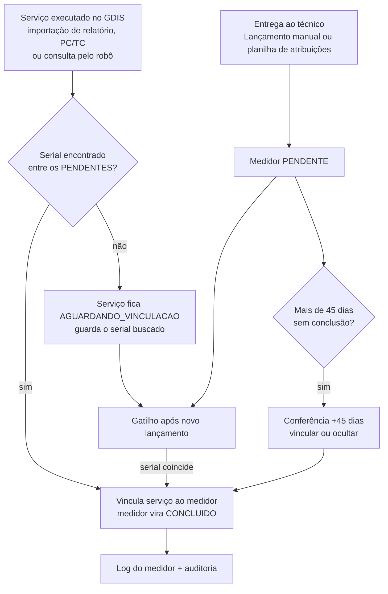

# Diagrama 03 — Fluxo de conciliação entrega x serviço (verificado em `CONTEXTO_GERAL.md` §8 e §9)

```mermaid
flowchart TD
    A["Entrega ao técnico<br/>Lançamento manual ou planilha de atribuições"] --> B["Medidor PENDENTE"]
    S["Serviço executado no GDIS<br/>importação de relatório, PC/TC<br/>ou consulta pelo robô"] --> C{"Serial encontrado<br/>entre os PENDENTES?"}
    C -- "sim" --> D["Vincula serviço ao medidor<br/>medidor vira CONCLUIDO"]
    C -- "não" --> E["Serviço fica AGUARDANDO_VINCULACAO<br/>guarda o serial buscado"]
    B --> F["Gatilho após novo lançamento"]
    E --> F
    F -- "serial coincide" --> D
    B --> G{"Mais de 45 dias<br/>sem conclusão?"}
    G -- "sim" --> H["Conferência +45 dias<br/>vincular ou ocultar"]
    H --> D
    D --> I["Log do medidor + auditoria"]
```
